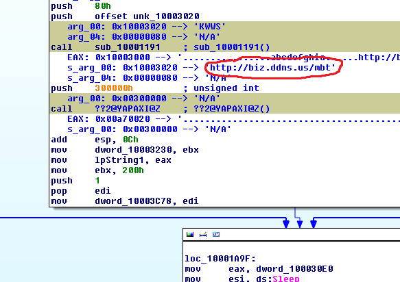

funcap
======

_IDA Pro script to add some useful runtime info to static analysis._

This script records the function call (and returns) across an executable using IDA debugger together with all the arguments passed, dumps the info to a text file, and also inserts it into IDA's inline comments. This way, static analysis that  usually follows the behavioral runtime analysis when analyzing malware, can be directly fed with runtime info such as decrypted strings returned in function's arguments. In author's opinion this allows to understand the program's logic way faster than starting the "zero-knowledge" reversing. Quick understanding of a malware sample code was precisely the motivation to write this script. It is best to see the examples with screenshot to see how it works.

On the following example funcap has recorded a call to a function that was decoding a string - http://www.encryptedc2.com/get_commands.php. The analyst knows right away the role of the function without even looking inside it. 

Similar example, this time taken from a real world of targeted attacks. A Taidoor malware sample has been captured here during the decryption of its C2 data:

